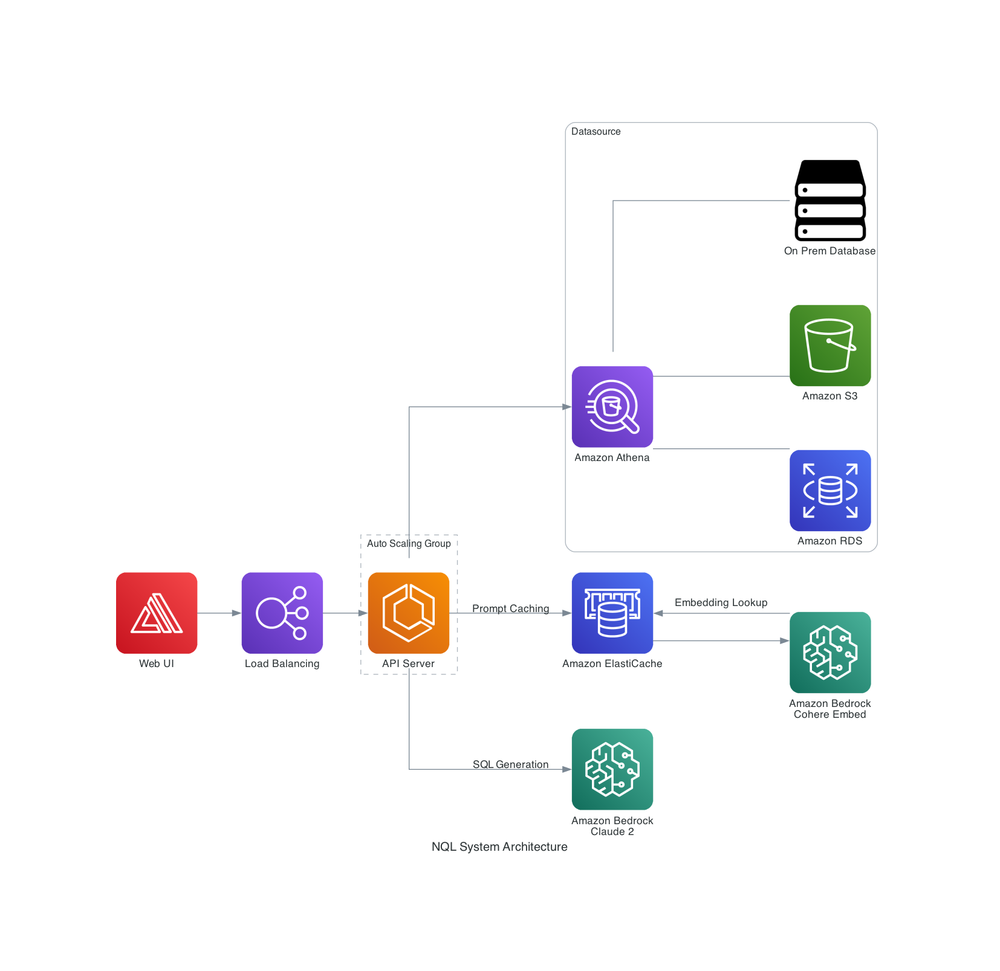

# NQL

## Description

NQL, or Natural Query Language, aims to assist in data insights by providing a natural language interface to data. NQL is a query language that allows users to query data using natural language. NQL is a domain specific language that is designed to be used by non-technical users. NQL is designed to be used with a data sources such as Athena, RDS, S3, or On-Prem Database.

## About the project

NQL project was intiated during my internship at AWS on May 2023 - August 2023. This repository is a continuation of the project to be presented in [ISE Open House 2023](https://web.facebook.com/ISEopenhouse/posts/pfbid02LydzRUfsJdg7w2YtNeysMMK33rvyZ597WwG4EFYmvVJMk9Yj55Q4rMTxTZpyNRHjl) which is held on 11th November 2023 at International School of Engineering, Chulalongkorn University.

There are several improvements that I have made/will make to the project, which are:

- [x] Utilizing [Turborepo](https://turbo.build/) to manage all source code related to backend and frontend
- [x] Using [Nest.js](https://nestjs.com/) as the backend framework, replacing the previous [Flask](https://flask.palletsprojects.com) framework to improve robustness and scalability
- [x] Using [Next.js](https://nextjs.org/) as the frontend framework with proper utilization of RSC (React Server Component) to improve performance and user experience
- [ ] Implemented prompt caching layer to improve performance and minimize unnecessary inference calls
- [x] Added data streaming support to allow users see generated SQL in real-time
- [x] Minor improvements on User Interface

## System Architecture



## Get started

### Prerequisites

- [Docker](https://www.docker.com/)
- [Node.js](https://nodejs.org/en/)
- [Pnpm](https://pnpm.io/)

### Installation

1. Clone the repository

```bash
git clone git@github.com:tontan2545/NQL.git
```

2. Install dependencies

```bash
pnpm install
```

3. Start the development server

```bash
pnpm dev
```

and open in a seperate terminal

```bash
docker-compose up
```

_Note_: If you want to start the development server with a specific project, you can run

```bash
pnpm dev --filter <project>
```

4. You'll be able to access

- Frontend App at [http://localhost:3000](http://localhost:3000)
- Backend API Server at [http://localhost:8000](http://localhost:8000)
- Postgres Database at [http://localhost:5432](http://localhost:5432)

## Installing dependencies

This project uses [pnpm](https://pnpm.io/) as the package manager, you can install dependencies by running

```bash
pnpm install <package>
```

Since this project uses [Turborepo](https://turbo.build/), you can install dependencies to a specific project by running

```bash
pnpm install --filter <project> <package>
```
